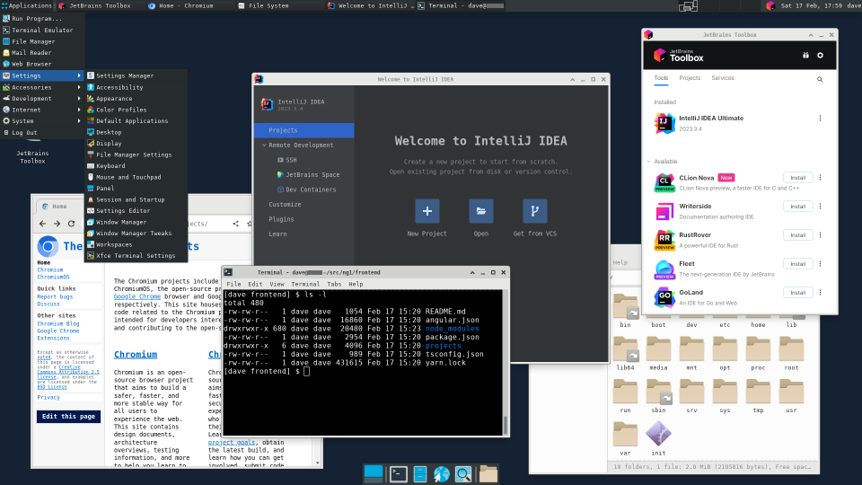

# Notes

_This page includes random notes that should one day become proper documentation._

### The graphical environment:
  - A lightweight XFCE desktop is accessible by connecting to _localhost_ from
      a remote desktop client such as Microsoft Remote Desktop or FreeRDP. You won't
      need an X11 server (such as VcXsrv or Xming) running on the Windows host.
  - This comes with JetBrains Toolbox, plus Firefox and Chromium.
  - 

### The devcontainer:
  - As developers, we want to keep the WSL2 distro light, while also having a
  consistent and reproducible environment for all of our tools and dependencies.
  To achieve these goals:

    - SlideWSL installs Docker on the WSL2 host, along with
      Docker configuration files, container contexts,
      a convenient admin script, and, of course, Git.
    - We use Compose to launch the devcontainer (and others).
    - The service entry for the devcontainer in
      the Compose YAML grants it read-only access to the
      Docker assets through a bind mount allowing it to
      build and orchestrate all other containers.
    - The devcontainer communicates with the Docker daemon running
      in the WSL2 distro through a port managed by _socat_ that
      relays into the privileged socket.
    - Local customizations can be achieved through an optional script that
      runs when initializing the devcontainer.
  - The devcontainer includes containers for nginx, Angular, and PHP.
  You can perform one-off yarn and composer installs and ng builds.
 
### Customizations

  - When building or reattaching to the devcontainer, you might want to
  do prep work or customizations, such as adding or updating file assets, or doing conversions
  such as by running dos2unix:
    - If a script called `sync.sh` exists, it will run before launching the devcontainer.
    - If this results in changes to the timestamps of the launcher or sync scripts, the launcher restarts.
  - Your sync script can be used during a fresh installation by using
    an argument to getslidewsl.bat, such as:
    `getslidewsl myusr mypswd ..\local\sync.sh`
  - Place customizations in the SlideWSL `local` folder (this is in .gitignore). For example:
    - Store your `sync.sh` here and let it copy itself into place.
    - Create your own `motd.extras` to append more info to the message-of-the-day.
    - Make `nginx.custom.conf` to specify a new app-to-doc-root folder mapping.
    - Add browscap with `php.extras.ini` and copy `browscap.ini` to `php/extras`.
    - Write a replacement `dev-server.conf` to map apps to your `ng serve` commands.
    - Use `.env.devcontainer` to set your own web, angular, and laravel root folders.
    - Use `.env.php` to set `APP_ENV` for laravel.
    - rsync an entirely new branch of SlideWSL.

### Debugging:

  - In order to debug using IntelliJ with WSL2 and Xdebug,
the devcontainer launcher script exports the _WSL2 gateway IP address_ to a variable.
  - This variable is used in php.ini to allow the php-fpm container to connect to the IDE:
`xdebug.client_host=${WSL2_GATEWAY}`.

  - You may run into the following issues:
  [4139](https://github.com/microsoft/WSL/issues/4139),
  [11139](https://github.com/microsoft/WSL/issues/11139).

  - More details from [JetBrains](https://www.jetbrains.com/help/idea/how-to-use-wsl-development-environment-in-product.html#debugging_system_settings).

  - Your experience might be different if you're using WSL2 _mirrored_ networking.

  - The workaround involves updates to the Windows Defender Firewall:

    ```powershell
    # From elevated PowerShell
    New-NetFirewallRule -DisplayName "WSL" -Direction Inbound -InterfaceAlias "vEthernet (WSL)" -Action Allow
    Get-NetFirewallProfile -Name Public | Get-NetFirewallRule | where DisplayName -ILike "IntelliJ IDEA*" | Disable-NetFirewallRule
    ```

### Laravel

  - Requests to `/api` are routed to Laravel's `public/index.php`.
    Angular's `proxy.conf.json` for the webpack dev server
    should use target `http://nginx:8080` with `changeOrigin: false`.

### Miscellaneous

- The output from WSL2 provisioning can be viewed with `sudo less /root/provision.log`.

- Remember you could [export](https://learn.microsoft.com/en-us/windows/wsl/basic-commands#export-a-distribution) your WSL distro for repeat installs.

- For LAN access over RDP, adjust firewalls as needed and create a port forward for Windows
using commands like:

  ```dosbatch
  wsl -e sh -c "ip route show | grep -i default | awk '{ print $3}'"
  netsh interface portproxy add v4tov4 listenport=3390 listenaddress=0.0.0.0 connectport=3390 connectaddress=<ip>
  netsh interface portproxy show all
  netsh interface portproxy delete v4tov4 listenport=3390 listenaddress=0.0.0.0
  ```

- You may want to copy your .ssh folder into the WSL distro, such as:

  ```bash
  cp /mnt/c/Users/<name>/.ssh/id_* ~/.ssh
  cp /mnt/c/Users/<name>/.ssh/config ~/.ssh
  chmod 600 ~/.ssh/config ~/.ssh/id_*
  export ANY_SECURITY_TOKENS=value
  ```

- Why drvfs is slow:
  - https://github.com/microsoft/WSL/issues/873#issuecomment-425272829
  - https://github.com/microsoft/WSL/issues/4197#issuecomment-604592340
  - plan9/9p https://en.wikipedia.org/wiki/9P_(protocol)
  - plan9/9p https://superuser.com/questions/1643551/windows-10-wsl-mount-creates-9p-filesystem-instead-of-drvfs

- Hints on attaching an ext4 file system in WSL2:

  ```bash
  truncate -s 10G /mnt/d/database.vhd
  mkfs.ext4 /mnt/d/database.vhd
  mkdir /mnt/database
  mount -o loop /mnt/d/database.vhd /mnt/database
  sh -c 'echo /mnt/d/database.img /mnt/database ext4 loop 0 0 >>/etc/fstab'
  ```

- WSL2 best practices:
  - https://www.docker.com/blog/docker-desktop-wsl-2-best-practices/
  - https://docs.docker.com/desktop/wsl/best-practices/


### Walkthrough

- This is a basic walkthrough:
  - Install SlideWSL
  - If you have an existing project, clone it to `~/src`. In this example,
    we will skip this step and create a starter app instead.
  - Launch the devcontainer
  - Bring up our environment
    - Create Angular and Laravel starter apps
    - Run an Angular ng build
    - Launch the webpack dev server
    - Launch nginx and PHP-FPM (in this case, already up from previous step)
    - Tail the logs
  - If you're playing along, here's a block you can copy/paste in the devcontainer:
      ```
      docker compose run --build --rm angular_create_starter example; \
      docker compose run --build --rm laravel_create_starter; \
      docker compose run --build --rm angular_app_build example; \
      APPS="example" docker compose up --force-recreate angular_dev_server -d; \
      docker compose up -d; \
      docker compose logs nginx php-fpm angular_dev_server -f
      ```
  - Update the Windows `hosts` file:
    ```text
    127.0.0.1 local.example.com
    ```
  - Visit the example site:
    - Served from nginx: http://local.example.com
    - Served from webpack dev server: http://local.example.com:4201
  - Run `dcl list` to show images and containers.

---

  ```text
  C:\SlideWSL>getslidewsl dave mypassword
  user: dave
  OracleLinux_8_7 already exists. do you wish to delete it?
  Enter Y or N: [Y,N]?Y
  
  <snip>
  
  ----------------------------------------------------------
  
   Done!
  
   Start: 06:03:59.19
   End  : 06:07:55.67
  
   Now run  Windows Remote Desktop  (mstsc.exe)
   Use the computer location: localhost:3390
   Username: dave (and the password you provided)
  
   Or, for a terminal: wsl or oraclelinux87
   Or, for ssh: ssh dave@localhost -p 2223
  
  ----------------------------------------------------------
  
  
  C:\SlideWSL>wsl
  |
  | To launch the devcontainer: dcl help
  |
  
  
  [dave@wsl ~]$ dcl help
  |
  | Usage:
  | dcl [status|reset [cache]|list [stats]|clean|help]
  |
  | When no argument is provided:
  |   -Run or reattach to the devcontainer
  |
  | Optional arguments:
  |   status: Report if the devcontainer is running
  |   reset [cache]: Purge all containers, images, and (optional) build cache
  |   list [stats]: List all containers, images, and (optional) stats
  |   clean: Stop and remove the devcontainer container and image
  |   help: Show this usage info
  |
  | Aliases: dcl = dc-launcher = /docker/devcontainer-launcher.sh
  |
  
  
  [dave@wsl ~]$ dcl
  ✔ Container devcontainer Started
  
  |
  | |                                  |
  | |   Welcome to the devcontainer!   |
  | |                                  |
  |
  | Service management
  |  nginx and php-fpm:
  |   docker compose up -d
  |   (To rebuild: docker compose down -d; docker compose up -d --build)
  |  angular webpack dev server:
  |   APPS="<app> ..." docker compose up --force-recreate angular_dev_server -d
  |
  | One-offs
  |  docker compose run --build --rm angular_node_modules
  |  docker compose run --build --rm angular_app_build <app> [<base-href> [<other-args...>]]
  |  docker compose run --build --rm php-composer
  |
  | Create starter projects (if starting without an existing project)
  |  docker compose run --build --rm angular_create_starter <app>
  |  docker compose run --build --rm laravel_create_starter
  |
  | Tail the logs: docker compose logs nginx php-fpm angular_dev_server -f
  | Interactive Terminal: docker compose exec -it -u root <service> bash
  |
  | Use dchelp to redisplay this info.
  |
  
  
  [dave@devcontainer ~]$ docker compose run --build --rm angular_create_starter example
  generating application: example
  yarn run v1.22.19
  Packages installed successfully.
  
  
  [dave@devcontainer ~]$ docker compose run --build --rm laravel_create_starter
  Creating a "laravel/laravel" project at "./"
  Created project in /laravel/.
  Updating dependencies
  Publishing complete.
  
  
  [dave@devcontainer ~]$ docker compose run --build --rm angular_app_build example
  ✔ Browser application bundle generation complete.
  ✔ Copying assets complete.
  ✔ Index html generation complete.
  
  
  [dave@devcontainer ~]$ APPS="example" docker compose up --force-recreate angular_dev_server -d
  ✔ Container php-fpm Started
  ✔ Container nginx Started
  ✔ Container angular_dev_server Started
  
  
  [dave@devcontainer ~]$ docker compose up -d
  ✔ Container php-fpm Running
  ✔ Container nginx Running
  
  
  [dave@devcontainer ~]$ docker compose logs nginx php-fpm angular_dev_server -f
  nginx               | fixuid: fixuid should only ever be used on development systems. DO NOT USE IN PRODUCTION
  nginx               | fixuid: updating user 'nginx' to UID '1000'
  nginx               | fixuid: updating group 'nginx' to GID '1000'
  nginx               | fixuid: recursively searching path /
  php-fpm             | fixuid: fixuid should only ever be used on development systems. DO NOT USE IN PRODUCTION
  php-fpm             | fixuid: runtime UID '1000' already matches container user 'php' UID
  php-fpm             | fixuid: runtime GID '1000' already matches container group 'php' GID
  php-fpm             | Installing dependencies from lock file (including require-dev)
  php-fpm             | Verifying lock file contents can be installed on current platform.
  php-fpm             | Nothing to install, update or remove
  php-fpm             | Package fruitcake/laravel-cors is abandoned, you should avoid using it. No replacement was suggested.
  php-fpm             | Package swiftmailer/swiftmailer is abandoned, you should avoid using it. Use symfony/mailer instead.
  php-fpm             | Generating optimized autoload files
  php-fpm             | > Illuminate\Foundation\ComposerScripts::postAutoloadDump
  php-fpm             | > @php artisan package:discover --ansi
  php-fpm             | Discovered Package: facade/ignition
  php-fpm             | Discovered Package: fruitcake/laravel-cors
  php-fpm             | Discovered Package: laravel/sail
  php-fpm             | Discovered Package: laravel/sanctum
  php-fpm             | Discovered Package: laravel/tinker
  php-fpm             | Discovered Package: nesbot/carbon
  php-fpm             | Discovered Package: nunomaduro/collision
  php-fpm             | Package manifest generated successfully.
  php-fpm             | 79 packages you are using are looking for funding.
  php-fpm             | Use the `composer fund` command to find out more!
  php-fpm             | [11-Mar-2024 06:38:51] NOTICE: [pool www] 'user' directive is ignored when FPM is not running as root
  php-fpm             | [11-Mar-2024 06:38:51] NOTICE: [pool www] 'user' directive is ignored when FPM is not running as root
  php-fpm             | [11-Mar-2024 06:38:51] NOTICE: [pool www] 'group' directive is ignored when FPM is not running as root
  php-fpm             | [11-Mar-2024 06:38:51] NOTICE: [pool www] 'group' directive is ignored when FPM is not running as root
  php-fpm             | [11-Mar-2024 06:38:51] NOTICE: fpm is running, pid 1
  php-fpm             | [11-Mar-2024 06:38:51] NOTICE: ready to handle connections
  nginx               | fixuid: chown /tmp/nginx
  nginx               | fixuid: chown /tmp/nginx/conf.d
  nginx               | /docker-entrypoint.sh: /docker-entrypoint.d/ is not empty, will attempt to perform configuration
  nginx               | /docker-entrypoint.sh: Looking for shell scripts in /docker-entrypoint.d/
  nginx               | /docker-entrypoint.sh: Launching /docker-entrypoint.d/10-listen-on-ipv6-by-default.sh
  nginx               | 10-listen-on-ipv6-by-default.sh: info: /etc/nginx/conf.d/default.conf is not a file or does not exist
  nginx               | /docker-entrypoint.sh: Sourcing /docker-entrypoint.d/15-local-resolvers.envsh
  nginx               | /docker-entrypoint.sh: Launching /docker-entrypoint.d/20-envsubst-on-templates.sh
  nginx               | 20-envsubst-on-templates.sh: Running envsubst on /etc/nginx/templates/angular-proxy.conf.template to /tmp/nginx/conf.d/angular-proxy.conf
  nginx               | 20-envsubst-on-templates.sh: Running envsubst on /etc/nginx/templates/angular_php.conf.template to /tmp/nginx/conf.d/angular_php.conf
  nginx               | /docker-entrypoint.sh: Launching /docker-entrypoint.d/30-tune-worker-processes.sh
  nginx               | /docker-entrypoint.sh: Configuration complete; ready for start up
  nginx               | 2024/03/11 06:38:51 [notice] 1#1: using the "epoll" event method
  nginx               | 2024/03/11 06:38:51 [notice] 1#1: nginx/1.25.4
  nginx               | 2024/03/11 06:38:51 [notice] 1#1: built by gcc 12.2.0 (Debian 12.2.0-14)
  nginx               | 2024/03/11 06:38:51 [notice] 1#1: OS: Linux 5.15.133.1-microsoft-standard-WSL2
  nginx               | 2024/03/11 06:38:51 [notice] 1#1: getrlimit(RLIMIT_NOFILE): 1048576:1048576
  nginx               | 2024/03/11 06:38:51 [notice] 1#1: start worker processes
  nginx               | 2024/03/11 06:38:51 [notice] 1#1: start worker process 34
  nginx               | 2024/03/11 06:38:51 [notice] 1#1: start worker process 35
  nginx               | 2024/03/11 06:38:51 [notice] 1#1: start worker process 36
  nginx               | 2024/03/11 06:38:51 [notice] 1#1: start worker process 37
  nginx               | 2024/03/11 06:38:51 [notice] 1#1: start worker process 38
  nginx               | 2024/03/11 06:38:51 [notice] 1#1: start worker process 39
  nginx               | 2024/03/11 06:38:51 [notice] 1#1: start worker process 40
  nginx               | 2024/03/11 06:38:51 [notice] 1#1: start worker process 41
  angular_dev_server  | fixuid: fixuid should only ever be used on development systems. DO NOT USE IN PRODUCTION
  angular_dev_server  | fixuid: runtime UID '1000' already matches container user 'node' UID
  angular_dev_server  | fixuid: runtime GID '1000' already matches container group 'node' GID
  angular_dev_server  | yarn install v1.22.19
  angular_dev_server  | [1/4] Resolving packages...
  angular_dev_server  | success Already up-to-date.
  angular_dev_server  | Done in 0.44s.
  angular_dev_server  | starting webpack dev server(s) for: example
  angular_dev_server  | (if example doesn't exist, you might see the error: Unknown arguments)
  angular_dev_server  | running ng serve example --port 4301 --host=0.0.0.0 --disable-host-check
  angular_dev_server  | done
  ^C canceled
  
  
  [dave@devcontainer ~]$ exit
  |
  | Welcome back!
  |
  | To launch the devcontainer: dcl help
  |
  
  
  [dave@wsl ~]$ dcl list
  
   images
  REPOSITORY                        TAG       IMAGE ID       CREATED          SIZE
  slidewsl-angular_dev_server       latest    4c1e11e8dd4d   31 minutes ago   995MB
  slidewsl-nginx                    latest    b3c37b53e1db   31 minutes ago   190MB
  slidewsl-angular_app_build        latest    1af38e76c900   32 minutes ago   995MB
  slidewsl-php-fpm                  latest    008f967c8e87   32 minutes ago   554MB
  slidewsl-laravel_create_starter   latest    949ca1ce1f6d   32 minutes ago   554MB
  slidewsl-php-composer             latest    215a304d5c03   32 minutes ago   554MB
  slidewsl-angular_create_starter   latest    582df0860813   35 minutes ago   995MB
  slidewsl-devcontainer             latest    ebde7379ae1e   36 minutes ago   530MB
  alpine/socat                      latest    a64760556c11   2 days ago       8.64MB
  
   containers
  CONTAINER ID   IMAGE                         COMMAND                  CREATED          STATUS          PORTS                                                    NAMES
  a89405ac60dd   slidewsl-angular_dev_server   "/bin/bash -c 'fixui…"   9 minutes ago    Up 9 minutes    4200-4210/tcp, 0.0.0.0:4300-4310->4300-4310/tcp          angular_dev_server
  a06be6c90635   slidewsl-nginx                "fixuid /docker-entr…"   9 minutes ago    Up 9 minutes    0.0.0.0:4200-4210->4200-4210/tcp, 0.0.0.0:80->8080/tcp   nginx
  12f063bbff3f   slidewsl-php-fpm              "fixuid prepare-vend…"   9 minutes ago    Up 9 minutes    9000/tcp                                                 php-fpm
  9badbcd46362   slidewsl-devcontainer         "fixuid /bin/sh -c '…"   12 minutes ago   Up 12 minutes                                                            devcontainer
  3e7b3886fd25   alpine/socat                  "socat tcp-listen:40…"   12 minutes ago   Up 12 minutes   127.0.0.1:2376->4000/tcp                                 socat
  
  [dave@wsl ~]$
  ```
