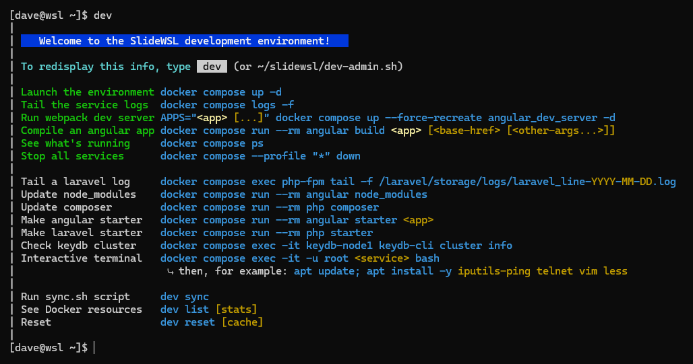

<!-- START doctoc generated TOC please keep comment here to allow auto update -->
<!-- DON'T EDIT THIS SECTION, INSTEAD RE-RUN doctoc TO UPDATE -->
**Table of Contents**  *generated with [DocToc](https://github.com/thlorenz/doctoc)*

- [Notes](#notes)
    - [Basic walkthrough](#basic-walkthrough)
    - [Development environment](#development-environment)
    - [Graphical interface](#graphical-interface)
    - [Customizations](#customizations)
    - [Virtual disk image](#virtual-disk-image)
    - [YAML Q&A](#yaml-qa)
    - [IntelliJ](#intellij)
      - [PHP](#php)
      - [Debugging](#debugging)
    - [Laravel](#laravel)
    - [Miscellaneous](#miscellaneous)

<!-- END doctoc generated TOC please keep comment here to allow auto update -->

<!-- doctoc NOTES.md --github -->

# Notes


### Basic walkthrough

- Steps:
    - Install SlideWSL
    - Create a starter app
    - Launch nginx, PHP-FPM/Laravel, KeyDB, MySQL, and phpMyAdmin
    - Launch the webpack dev server
    - Tail the logs
- Here's a block you can copy/paste:
  ```bash
  docker compose run --rm angular starter example \
    && docker compose run --rm php starter \
    && docker compose up -d \
    && APPS="example" docker compose up --force-recreate angular_dev_server -d \
    && docker compose logs -f
  ```
  But, if you already have a project in place, you'd skip the _starter_ steps and add a _build_ step like this:
  ```bash
  docker compose up -d \
    && docker compose run --rm angular build my-project \
    && APPS="my-project" docker compose up --force-recreate angular_dev_server -d \
    && docker compose logs -f
  ```
- Update the Windows `hosts` file:
  ```text
  127.0.0.1 local.example.com
  ```
- Visit the example site:
    - nginx: https://local.example.com (bypass self-signed cert warning)
    - webpack dev server: http://local.example.com:4201
    - phpMyAdmin (user/pass: root/root): http://localhost:8080/

---

```text
C:\SlideWSL>getslidewsl dave mypassword
user: dave
OracleLinux_8_7 already exists. do you wish to delete it?
Enter Y or N: [Y,N]?Y

<snip>

----------------------------------------------------------

 Done!

 Start: 06:50:47.96
 End  : 06:54:08.07

 Now run  Windows Remote Desktop  (mstsc.exe)
 Use the computer location: localhost:3390
 Username: dave (and the password you provided)

 Or, for a terminal: wsl or oraclelinux87
 Or, for ssh: ssh dave@localhost -p 2223

----------------------------------------------------------


C:\SlideWSL>wsl
|
| Welcome to the SlideWSL development environment!
|
| <snip>
|


[dave@wsl ~]$ docker compose run --rm angular starter example
generating application: example
yarn run v1.22.19
Packages installed successfully.
building with: ng build example --base-href=/
Initial Chunk Files           | Names         |  Raw Size | Estimated Transfer Size
main.6024eba3a956365b.js      | main          | 173.64 kB |                46.40 kB
polyfills.9acd7e87ef537323.js | polyfills     |  33.08 kB |                10.64 kB
runtime.92c8b83a3d996273.js   | runtime       | 892 bytes |               506 bytes
styles.ef46db3751d8e999.css   | styles        |   0 bytes |                       -
                              | Initial Total | 207.59 kB |                57.53 kB


[dave@wsl ~]$ docker compose run --rm php starter
Created project in /laravel/.
Updating dependencies
Publishing complete.


[dave@wsl ~]$ docker compose up -d
✔ Container keydb-node3       Started
✔ Container keydb-node2       Started
✔ Container slidewsl-init0-1  Exited
✔ Container keydb-node1       Started
✔ Container slidewsl-init-1   Started
✔ Container mysql             Started
✔ Container phpmyadmin        Started
✔ Container php-fpm           Started
✔ Container nginx             Started


[dave@wsl ~]$ APPS="example" docker compose up --force-recreate angular_dev_server -d
✔ Container angular_dev_server Started


[dave@wsl ~]$ docker compose logs -f
<snip>
^C canceled

[dave@wsl ~]$
```


### Development environment



Type `dev` (an alias for `~/slidewsl/dev-admin.sh`) to see a list of commands.
More commands might be added later to simplify administration (such as `dev list`).


### Graphical interface


A lightweight XFCE desktop is accessible by connecting to _localhost_ from
a remote desktop client such as Microsoft Remote Desktop or FreeRDP. You won't
need an X11 server (such as VcXsrv or Xming) running on the Windows host.
This comes with JetBrains Toolbox, plus Firefox and Chromium.


### Customizations

Preface: During installation, the Docker assets found in `src/assets/slidewsl` will be copied to `~/slidewsl`.
More specifically, they are expanded from the encoded chunks in `getslidewsl.bat`.

If you're interested in making customizations, here is one approach:

- Clone this repo to your Windows host (i.e., safely outside of the WSL2 distro).
- Place `sync.sh` in your repo's `local` folder. You'll find an example sync script in the local folder.
  - During a fresh install of SlideWSL, pass the location of your script: `getslidewsl myusr mypswd ..\local\sync.sh`
  - If you forget, you can start using after installation by copying your script into place,
    for example: `cp /mnt/c/users/dave/Desktop/git/slidewsl/local/sync.sh ~/slidewsl`.
- Run `dev sync` in WSL2. If found, it copies `~/slidewsl/sync.sh` to `/tmp` for execution.
  On return, if the timestamp of `~/slidewsl/sync.sh` changed, it runs again with the updated version.
- Example things to do in `sync.sh`:
  - `rsync` your `src/assets/slidewsl` folder to `~/slidewsl`.
  - Use `docker-custom.env` to override `docker-base.env` with your own _web_, _angular_, _laravel_, and _db_ folders.
  - Use `docker-php.env` to set `APP_ENV` for your laravel app.
  - Write a replacement `dev-server.conf` to map apps to custom `ng serve` commands.
  - Add support for browscap by copying an _.ini_ file to `~/slidewsl/php/conf`.
  - Use `docker-phpmyadmin.env` to define `PMA_USER` and `PMA_PASSWORD`.
  - Run `dos2unix` if necessary.


### Virtual disk image

Installation creates a sparse virtual hard disk image (using qemu-img
  in the qcow2 format).
  It's intended to be used for project and database files.
  The disk image can be disconnected in order to rebuild the underlying
  WSL2 host; it can then be seamlessly reattached without loss of data
  or configuration (such as local changes, branches and shelved items).
- The image file is created at `%userprofile%\slidewsl.img`
  and mounted at `/mnt/slidewsl`.
  It's set to grow to a max size of 20G.
- Symlinks (such as from $HOME to /mnt) are possible, but currently not advised.
- The mount is controlled by the `disk-image` systemd service.
- When unmounting or rebuilding WSL:
  - Be sure to stop IntelliJ, becauses:
    - It will attempt to create files under the mount folder when the image isn't mounted.
    - It can also create files as root before the default user is set, thereby causing user provisioning to fail.
  - Bring down docker containers or their processes might be killed.
- It's unclear if systemd shuts down gracefully when Windows shuts down or reboots:
  [8939](https://github.com/microsoft/WSL/discussions/11225),
  [11225](https://github.com/microsoft/WSL/issues/8939).

Additional Ideas:
- One interesting idea is to point `DOCKER_BUILDKIT_CACHE` at the disk image to speed
  things up after rebuilding WSL2.
- Similarly, another is to set `HISTFILE` to store `.bash_history` in the disk image.


### YAML Q&A

- Why both `compose.yaml` and `compose-slidewsl.yaml`?

  _env_file_ runs after bind mounting, so it can't be used to override variables in
  _.env_. To address this, `compose.yaml` loads _custom_ env files, before including
  `compose-slidewsl.yaml`.

- What is the _init_ service?

  If a volume source doesn't exist, the daemon creates it and makes _root_ the owner. To
  deal with this, some services depend on an _init_ service to ensure folders are properly
  created and writable.


### IntelliJ

Open your project using: `\\wsl$\OracleLinux_8_7\mnt\slidewsl\<username>\src`.

#### PHP

  - Use the PHP Docker plugin in IntelliJ to work remotely with the PHP CLI from the _slidewsl-php-fpm_ Docker container.
  - Enable PHP CS Fixer using the same container and the path: `/tools/vendor/friendsofphp/php-cs-fixer/php-cs-fixer`

#### Debugging

  - In order to debug using IntelliJ with WSL2 and Xdebug,
the WSL2 distro assigns the _WSL2 gateway IP address_ to a variable.
  - This variable is used in php.ini to allow the php-fpm container to connect to the IDE:
`xdebug.client_host=${WSL2_GATEWAY}`.

  - You may run into the following issues:
  [4139](https://github.com/microsoft/WSL/issues/4139),
  [11139](https://github.com/microsoft/WSL/issues/11139).

  - More details from [JetBrains](https://www.jetbrains.com/help/idea/how-to-use-wsl-development-environment-in-product.html#debugging_system_settings).

  - Your experience might be different if you're using WSL2 _mirrored_ networking.

  - The workaround involves updates to the Windows Defender Firewall:

    ```powershell
    # From elevated PowerShell
    New-NetFirewallRule -DisplayName "WSL" -Direction Inbound -InterfaceAlias "vEthernet (WSL)" -Action Allow
    Get-NetFirewallProfile -Name Public | Get-NetFirewallRule | where DisplayName -ILike "IntelliJ IDEA*" | Disable-NetFirewallRule
    ```

### Laravel

  - Browser requests to `/api` are routed to Laravel's `public/index.php`.
  - Update Angular's `proxy.conf.json` as shown here:
    ```json
    {
      "/api/": {
        "target": "https://nginx:4430",
        "secure": false,
        "changeOrigin": false
      }
    }
    ```
  - For debugging in IntelliJ, map the value of `SLIDEWSL_LARAVEL_ROOT_IN_WSL` to `/laravel`
    under `Settings | Languages & Frameworks | PHP | Servers`.

### Miscellaneous

- The output from WSL2 provisioning can be viewed with `sudo less /root/provision.log`.

- You could [export](https://learn.microsoft.com/en-us/windows/wsl/basic-commands#export-a-distribution) your WSL2 distro for repeat installs.

- For LAN access over RDP, adjust firewalls as needed and create a port forward for Windows
using commands like:

  ```dosbatch
  wsl -e sh -c "ip route show | grep -i default | awk '{ print $3}'"
  netsh interface portproxy add v4tov4 listenport=3390 listenaddress=0.0.0.0 connectport=3390 connectaddress=<ip>
  netsh interface portproxy show all
  netsh interface portproxy delete v4tov4 listenport=3390 listenaddress=0.0.0.0
  ```

- You may want to copy your .ssh folder into the WSL distro, such as:

  ```bash
  cp /mnt/c/Users/<name>/.ssh/id_* ~/.ssh
  cp /mnt/c/Users/<name>/.ssh/config ~/.ssh
  chmod 600 ~/.ssh/config ~/.ssh/id_*
  export OTHER_SECURITY_TOKENS=value
  ```

- Why drvfs is slow:
  - https://github.com/microsoft/WSL/issues/873#issuecomment-425272829
  - https://github.com/microsoft/WSL/issues/4197#issuecomment-604592340
  - plan9/9p https://en.wikipedia.org/wiki/9P_(protocol)
  - plan9/9p https://superuser.com/questions/1643551/windows-10-wsl-mount-creates-9p-filesystem-instead-of-drvfs

- [Synchronized file shares](https://docs.docker.com/desktop/synchronized-file-sharing/)

- WSL2 best practices:
  - https://www.docker.com/blog/docker-desktop-wsl-2-best-practices/
  - https://docs.docker.com/desktop/wsl/best-practices/
  - https://learn.microsoft.com/en-us/windows/wsl/setup/environment
